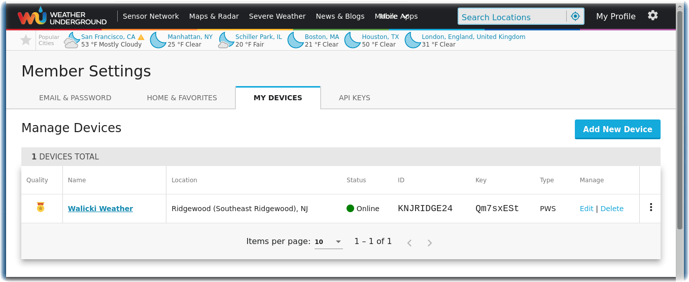
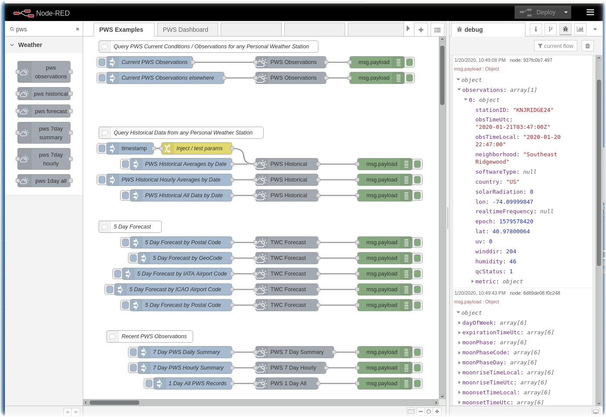
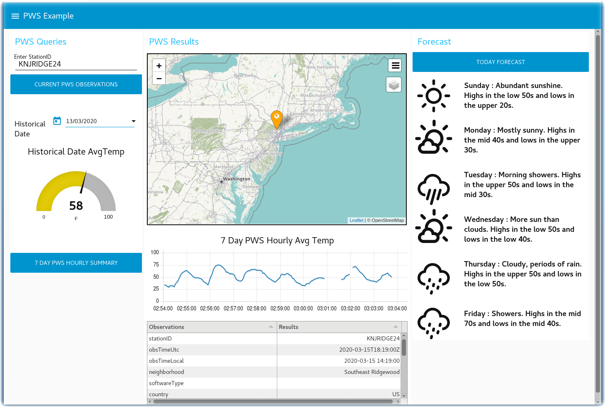

# node-red-contrib-twc-weather
Node-RED nodes for The Weather Company and Weather Underground Personal Weather Station APIs

These nodes replace the depreciated **node-red-node-weather-underground** with new TWC apis for querying [wunderground.com](https://wunderground.com) Personal Weather Station (PWS) data.

The set of nodes in this package implement the [APIs for Personal Weather Station Contributors](https://docs.google.com/document/d/1eKCnKXI9xnoMGRRzOL1xPCBihNV2rOet08qpE_gArAY).

The Weather Company provides [TWC Weather Data Packages](https://www.ibm.com/products/weather-company-data-packages) that are available for purchase. Node-RED nodes in this package implement select API services.

If you are building [Call for Code Global Challenge](https://developer.ibm.com/callforcode) solutions that fight [climate change](https://developer.ibm.com/callforcode/get-started/climate-change/), you can register and receive a time-limited free trial [TWC API key](https://developer.ibm.com/callforcode/tools/weather/) to assist in your projects.  This TWC API key can be used for many of the Node-RED nodes in this node-red-contrib-twc-weather package. 

## Install

Either use the Editor - Menu - Manage Palette - Install option, or run the following command in your Node-RED user directory (typically `~/.node-red`).
```
$ npm install node-red-contrib-twc-weather
```

## Usage

Register your Personal Weather Station at [wunderground](https://www.wunderground.com/member/devices) and copy your PWS Station ID and API Key into these Node-RED nodes.



## node-red-contrib-twc-weather Nodes

This Node-RED package creates six PWS nodes in your Node-RED palette.
- **pws observations** - Personal Weather Station (PWS) Current Conditions returns the current conditions observations.
- **pws historical** - Personal Weather Station (PWS) Historical Data returns the historical PWS data for a single date ( hourly data, summary data for the entire day, or all records )
- **pws forecast** - The Daily Forecast API is sourced from the The Weather Company Forecast system. This TWC API returns the 5 Day Daily weather forecast.
- **pws 7 day summary** - Personal Weather Station (PWS) Daily Summary Historical Observations returns the 7 day summary of daily observations.
- **pws 7 day hourly** - Personal Weather Stations (PWS) Hourly Historical Observations returns the hourly records for each days observations report.
- **pws 1 day all** - Personal Weather Station (PWS) Rapid Historical Observations returns all of the observations records for a specific date.

This Node-RED package creates TWC nodes in your Node-RED palette.
- **TWC Daily Forecast** - (3, 5, 7, 10, 15 Day) Daily Forecast API from the TWC Core Weather Data Package.
- **TWC Health Forecast** - The Cognitive Health Forecast API provides forecast data for the risk of allergy, migraine, cold and flu, or pain for a given location and for a period of one to 15 days in advance.
- **TWC Nowcast** - The short range Nowcast Forecast API provides a text summary of the weather forecast for the next 6 hour period for today.

Review the [CHANGELOG](https://github.com/johnwalicki/node-red-contrib-twc-weather/blob/master/CHANGELOG.md) for enhancement history.

## Examples

Two examples are provided in the [examples](https://github.com/johnwalicki/node-red-contrib-twc-weather/tree/master/examples) folder.

- Exercise each of the Node-RED PWS APIs by importing this [PWS-Examples.json flow](https://github.com/johnwalicki/node-red-contrib-twc-weather/blob/master/examples/PWS-Examples.json)



- Here is an example Weather Node-RED Dashboard that displays Personal Weather Station current and historical data on a map, in a table, a gauge and on a chart. The PWS API key includes access to the TWC 5 Day Forecast, which is displayed with [weather-lite icons](https://github.com/Paul-Reed/weather-icons-lite). This flow requires node-red-dashboard, node-red-node-ui-table and node-red-contrib-web-worldmap.  Import this [PWS-Dashboard.json flow](https://github.com/johnwalicki/node-red-contrib-twc-weather/blob/master/examples/PWS-Dashboard.json)



## Contributing and Developer information

For reporting bugs, security issues, requesting features, and discussing changes, developers should use GitHub issues. Give me [feedback](https://github.com/johnwalicki/node-red-contrib-twc-weather/issues) if you have suggestions on how to improve these nodes.

The Node-RED community welcomes your involvement and contributions to this project. Pull requests are welcome.

#### Author

- [John Walicki](https://github.com/johnwalicki/)

___

## License

This npm package is licensed under the Apache Software License, Version 2.  Separate third party code objects invoked within this code pattern are licensed by their respective providers pursuant to their own separate licenses. Contributions are subject to the [Developer Certificate of Origin, Version 1.1 (DCO)](https://developercertificate.org/) and the [Apache Software License, Version 2](http://www.apache.org/licenses/LICENSE-2.0.txt).

[Apache Software License (ASL) FAQ](http://www.apache.org/foundation/license-faq.html#WhatDoesItMEAN)
